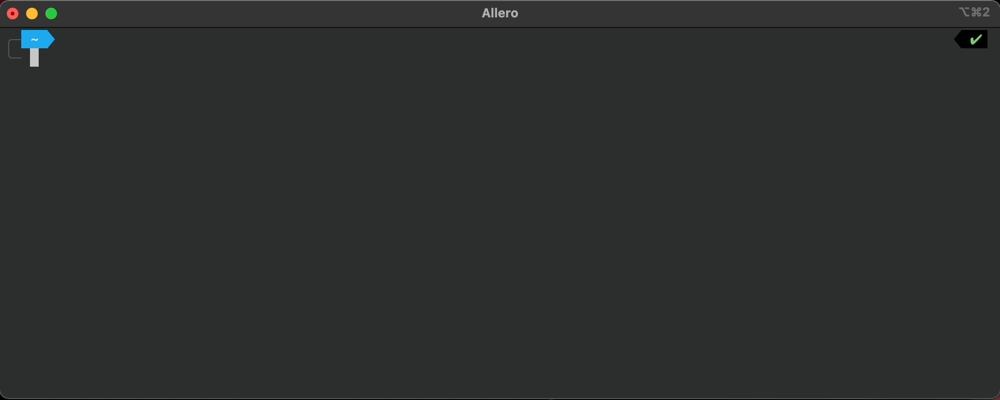

 

<h1 align="center">
Prevent CI/CD misconfiguration
</h1>

## What is Allero?
Allero is a policy tool that prevents misconfigurations in CI/CD pipelines. 
This helps prevent failures and security risks from reaching production. It also allows R&D teams be less dependent on DevOps engineers when building and maintaining CI/CD pipelines.
Allero comes with built-in rules, and developed to be as friendly as possible for you to create your own rules!  
**Here are a few use-cases that can be mitigated with Allero:**
1. Prevent Log4shell vulnerability by making sure SCA runs in every pipeline.
2. Prevent the use of deprecated language versions. (e.g. Node version <= 12)  
3. Ensure all IaC manifests are scanned for misconfigurations. (e.g. Run checkov on any terraform file)

## Quick Start!
Allero supports GitHub Actions and GitLab Pipelines.
### 1. Install the latest release in your terminal
_Linux & MacOS:_ `curl https://get.allero.io | /bin/bash`  
_Brew:_ `brew install allero-io/allero/allero`  
_Windows:_ `iwr -useb https://get.allero.io/windows_install.ps1 | iex`

### 2. Validate your pipelines
Local directory - a direct validate:
* Validate your pipelines located under a path: `allero validate {path}`
Remote directory - Fetch your data and then validate:
* Fetch your organizations and/or repositories: `allero fetch github dapr/dapr`
* Validate your pipelines across all your fetched data: `allero validate`

### Fetching private repositories from Github
Fetching data from a private GitHub organization requires a personal access token (PAT).
1. Create a GitHub PAT with access to the repos you want to scan. More information about how to create a Github PAT can be found [here](https://docs.github.com/en/authentication/keeping-your-account-and-data-secure/creating-a-personal-access-token#creating-a-token) 
Generate the token with the following **read** permissions:
    - [x]  repo:
        - [x]  repo:status
        - [x]  repo_deployment
        - [x]  public_repo
        - [x]  repo:invite
        - [x]  security_events

2. Once the token is generated, run `export ALLERO_GITHUB_TOKEN={YOUR_TOKEN}`.  
- When running Allero from GitHub Actions, the PAT should be stored as an [encrypted secret](https://docs.github.com/en/actions/security-guides/encrypted-secrets#creating-encrypted-secrets-for-a-repository).
3. Fetch your private repositories: `allero fetch github {your_repo}`

### Fetching private repositories from Gitlab
Fetching data from a private GitLab group requires an access token.
1. Create a GitLab Access Token with access to the repos you want to scan. More information about how to create a GitLab Token can be found [here](https://docs.gitlab.com/ee/user/profile/personal_access_tokens.html) 
Generate the token with the following permissions:
    - [x]  read_api
2. Once the token is generated, run `export ALLERO_GITLAB_TOKEN={YOUR_TOKEN}`.
3. Fetch your private repositories: `allero fetch gitlab {your_repo}`

## Next Steps
### ⛔️ Fail a PR on violation 
Allero can fail a PR if the repo's pipelines don't meet the policy.
Use this [GitHub Action](https://github.com/allero-io/allero/tree/main/examples/integrations/allero-validate-on-pr.yml) to trigger allero validation on a PR event.
### 🛡 Continuously assess all your piplines on a daily basis 
To achieve a continuous assessment, allero needs to periodically scan the entire organization.  
_Implementing with GitHub Actions_: We created a [GitHub Action](https://github.com/allero-io/allero/tree/main/examples/integrations/allero-continuous-validation.yml) that runs Allero everyday at 8am on your entire organization.
1. [Fork](https://github.com/allero-io/allero/fork) Allero repo
2. Create a GitHub Personal Access Token and store it in your forked repo as an encrypted secret named `ALLERO_GITHUB_TOKEN`.
3. GitHub disables scheduled Actions on a forked repo by default. To enable the Allero Action, browse to your forked allero repo, navigate to GitHub Actions and enable the workflow. 

_Using any other scheduler:_ as a CLI tool, Allero can be easily run in - CI/CD, docker scheduler, crontab, kubernetes - anywhere!

## 🚨 Rules
Some rules apply to everyone, while others are very stack-specific. That is why some rules are enabled by default and others are disabled. Learn how to enable and disable rules [here](https://github.com/allero-io/allero#enabling-and-disabling-rules).

### Supported Rules

| _Rule Name_               | _Description_                                            | _Default State_               | _Reason_                                                                                                               |
| ------------------------- | -------------------------------------------------------- | ----------------------------- | ---------------------------------------------------------------------------------------------------------------------- |
| prevent-npm-install       | Prevents the usage of `npm install` in pipelines. We recommend using `npm ci` instead           | Enabled | [link](https://betterprogramming.pub/npm-ci-vs-npm-install-which-should-you-use-in-your-node-js-projects-51e07cb71e26) |
| prevent-kubectl-apply     | Prevents the usage of kubectl apply in pipelines. We recommend using helm or any other k8s deployment tool         | Enabled | [link](https://medium.com/@RedBaronDr1/helm-vs-kubectl-5aaf2dba7d71)                                                   |
| ensure-npm-ignore-scripts | Ensures that pre/post-install scripts are not run by NPM | Enabled | [link](https://snyk.io/blog/ten-npm-security-best-practices/)                                                     |
| snyk-prevent-continue-on-error | Prevent continuing workflows when snyk detects vulnerabilities | Enabled | Keep production secured
| prevent-password-plain-text | Prevent use of password as plain text | Enabled | Keep passwords from leaking
| ensure-node-version | Make sure a specific version is set when using a node image | Enabled | Avoid unexpected behavior
| ensure-python-version | Make sure a specific version is set when using a python image | Enabled | Avoid unexpected behavior
| ensure-github-action-version | Ensure github action version is set | Enabled | Avoid unexpected behavior
| prevent-using-uncontrolled-values | Avoid running malware commands through repository names | Enabled | Keep production secured
| ensure-sca-scanner | Make sure every repository has at least one pipeline with (Trivy, BlackDuck, Grype) | Disabled | Keep production secured
| ensure-terraform-scanner | Make sure every repository has at least one pipeline with terraform scanner (Checkov ,Snyk, Tenable)  | Disabled | Keep production secured

### Enabling and disabling rules
A policy is a set of rules, and it is represented by a token.  
To generate a token, go to this [page](https://www.allero.io/selective-rules), choose the rules you want and generate the token. The token will be sent to your email.   
To run the policy, you need to set the token by running `allero config set token {your_token}` and re-run `allero validate`. 

#### Temporarily ignore a token
Tokens can be temporarily ignored during a single validation by running `allero validate --ignore-token`  
#### Clear a token
Tokens can be cleared from the CLI by running `allero config clear token`
| ensure-sca-scanner | Make sure every repository has at least one pipeline with sca scanner | Keep production secured
| ensure-terraform-scanner | Make sure every repository has at least one pipeline with terraform scanner  | Keep production secured

### 📝 Adding your own rules
Rules can be defined using the [Json Schema](https://json-schema.org/) format. Json Schema rules should be based on our data schema. An example of our data schema structure can be found [here](https://github.com/allero-io/allero/tree/main/examples/rules/data-schema-example.json).
1. Create a new json file and define your rule. Example rules can be found [here](https://github.com/allero-io/allero/tree/main/examples/rules).
Make sure to update the rule description and failureMessage.
2. Copy-paste the rule-files to "~/.allero/rules/github/" and "~/.allero/rules/gitlab/".
3. Run `allero validate`

## Contribution 👩🏽‍💻
We encourage you to contribute to Allero!
#### Created a new rule and want to give back to the community?
1. **Fork our repo**
2. **Read how to add your own rule [here](#adding-your-own-rules)**
3. **Add your rule to [pkg/rulesConfig/github](https://github.com/allero-io/allero/tree/main/pkg/rulesConfig/defaultRules/github) or to [pkg/rulesConfig/gitlab](https://github.com/allero-io/allero/tree/main/pkg/rulesConfig/defaultRules/gitlab) directories**
4. **Create a PR!**

**Interested in contributing more to the CLI?**
We will provide a more detailed explanation on how to contribute soon. If you're intrested, you can [contact us](mailto:contact@allero.io) to get our help with your first PR!

## 🔏 Privacy
Your privacy and code integrity are very important to us. That's why our CLI operates locally only, and doesn't save any sensitive information related to your code anywhere. We only track metrics that reflect your usage of the CLI :)
### Contact Us
Open an issue or shoot us an [email](mailto:contact@allero.io).
